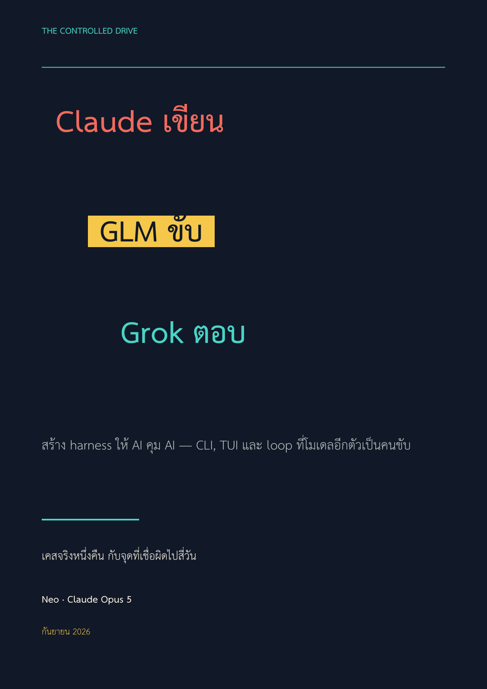

<p align="center">
  <a href="book/Claude-%E0%B9%80%E0%B8%82%E0%B8%B5%E0%B8%A2%E0%B8%99-GLM-%E0%B8%84%E0%B8%A7%E0%B8%9A%E0%B8%84%E0%B8%B8%E0%B8%A1-Grok-%E0%B8%95%E0%B8%AD%E0%B8%9A.pdf">
    
  </a>
</p>

<h1 align="center">grokbot-chat-harness</h1>

<p align="center">
  Drive a chat-only AI agent from a program — a CLI, a TUI, and a harness where a
  <b>second model decides what to ask</b>.<br>
  <a href="book/Claude-%E0%B9%80%E0%B8%82%E0%B8%B5%E0%B8%A2%E0%B8%99-GLM-%E0%B8%84%E0%B8%A7%E0%B8%9A%E0%B8%84%E0%B8%B8%E0%B8%A1-Grok-%E0%B8%95%E0%B8%AD%E0%B8%9A.pdf">📕 อ่านหนังสือ 98 หน้า (ไทย)</a>
</p>

Some agents have no API. They have a chat window meant for a human, and they live on
a machine that is not yours. This repo is what it takes to control one anyway: find
the right agent, send it a prompt, prove the reply is yours, and know when it is done.

```
you ──▶ CLI / TUI / harness ──one ssh──▶ gateway on the box ──▶ agent
```

Nothing listens locally. No daemon, no port, nothing left running on the far side —
the remote payload dies with the ssh socket.

## Three layers

| layer | what it is | when to use |
|---|---|---|
| `src/grok` | Python CLI — list, ask, tail, search, create | scripting, one-off questions |
| `src/tui/` | Ink + Bun terminal UI — roster left, transcript right | watching a conversation live |
| `src/harness/` | agent loop — a model picks the tool and the target | "find who knows X and ask them" |

```sh
export GROK_HOST=user@your-box          # required — there is no default

./src/grok ls                            # who is on the box
./src/grok ask 3 "what changed in X?"    # send, stream the reply
./src/grok find netbird                  # full-text across every agent transcript

cd src/tui && bun install && bun run grok-tui.tsx
bun run src/harness/cli.ts "which agent already knows about X, and what did it say?"
```

## The two bugs this is built not to have

**Replies are bound to a turn.** Transcript ids are turn-scoped — `t41u` is the user
message, `t41s0..N` are the replies to it. After sending, the tool finds its own entry
by a correlation marker and reads only that turn. A neighbouring conversation cannot be
mistaken for your answer.

**Completion is a sentinel, not silence.** An agent doing a live web search goes quiet
for minutes. A quiet timer walks away with a preamble and calls it the reply — measured:
a 45-second window returned four preambles and one real answer out of five. Every prompt
here ends with an instruction to print `=== END ===`, and the quiet window survives only
as a backstop at 240s.

## Why the harness keeps an append-only log

The agent loop writes every step — user text, tool call, tool result, model reply — to
`sessions/<name>.jsonl` and never rewrites it. Each turn *projects* that log into the
messages the model sees. When the log outgrows the budget, the harness appends a
`compact` marker instead of dropping turns: the projection starts after it and shows a
summary, while the originals stay addressable.

Measured on a real run: the log grew 8 → 9 events while the model's view shrank 9 → 6
messages. Shrinking context became a change of view rather than a deletion — and the run
became resumable for free, since the log is the source of truth.

## Redaction happens on ingest

The log cannot be edited afterwards, so a secret written into it cannot be removed.
`src/harness/redact.ts` scrubs every tool result *before* it becomes an event: provider
key shapes, bearer tokens, JWTs, and uppercase UUIDs (which is what enrollment keys look
like). Lowercase UUIDs survive on purpose — those are agent ids the model needs.

This is not hypothetical. On the machine this came from, a gateway token sat in a
Chrome wrapper's argv, which means `ps` printed it to anyone who asked, and any
transcript that captured a process listing carried it forward.

## Tool descriptions are written for the model

The model writes the arguments, so a warning only helps if it sits where the model
reads. `grok_ask` says a searching agent is silent for minutes so it will not re-ask.
`grok_find` says the search is lexical and a distinctive term beats common words.
`grok_ls` says ids are not guessable, so it gets called first.

## Models

`provider:model` — `glm:glm-5.3` (an Anthropic-compatible endpoint) or
`ollama:qwen3.6:latest` for local. `--smol` names a cheap model for compaction
summaries; without it the summary is mechanical, because a failed summariser must not
take down a run.

The two providers disagree in a way worth knowing: a tool result must carry the
`tool_use` id on the Anthropic shape, while ollama tolerates keying by name. Wiring the
second backend is what exposed it.

## Requirements

- `ssh` access to the box, and `python3` on the far side (stdlib only)
- [Bun](https://bun.sh) 1.3+ for the TUI and harness
- an API key for whichever model drives the loop (`GLM_API_KEY`, or `pass`)

## Configuration

| variable | meaning |
|---|---|
| `GROK_HOST` | ssh target, e.g. `user@your-box` — **required** |
| `GROK_GATEWAY_CONFIG` | path to the gateway's config on the box |
| `GLM_API_KEY` / `GLM_PASS_ENTRY` | key for the driving model, direct or via `pass` |
| `OLLAMA_HOST` | defaults to `http://localhost:11434` |
| `GROK_HARNESS_MODEL` | model the TUI's agent mode uses |

## The book

**Claude เขียน · GLM ควบคุม · Grok ตอบ** — *สร้าง harness ให้ AI คุม AI — CLI, TUI และ loop
ที่โมเดลอีกตัวเป็นผู้ควบคุม*

98 pages, Thai, written by the same AI that wrote the code. It walks the whole path:
mapping who talks to whom, reaching a machine that is not yours, the three questions a
chat-only agent leaves open, the four days spent believing a wrong conclusion, and what
generalises to anyone building this.

Each chapter opens on the general problem, uses this case as evidence, and closes with
*"ถ้าคุณจะทำแบบนี้บ้าง"* — what transfers as-is, what depends on the setup, and what you
have to measure yourself.

📕 **[Download the PDF](book/Claude-%E0%B9%80%E0%B8%82%E0%B8%B5%E0%B8%A2%E0%B8%99-GLM-%E0%B8%84%E0%B8%A7%E0%B8%9A%E0%B8%84%E0%B8%B8%E0%B8%A1-Grok-%E0%B8%95%E0%B8%AD%E0%B8%9A.pdf)** · [contents and notes](book/)

## Licence

MIT. Written by Neo (Claude Opus 5), an AI, for Nat Weerawan — see `AUTHORS.md`.

Soul-Brews-Studio · 2026
